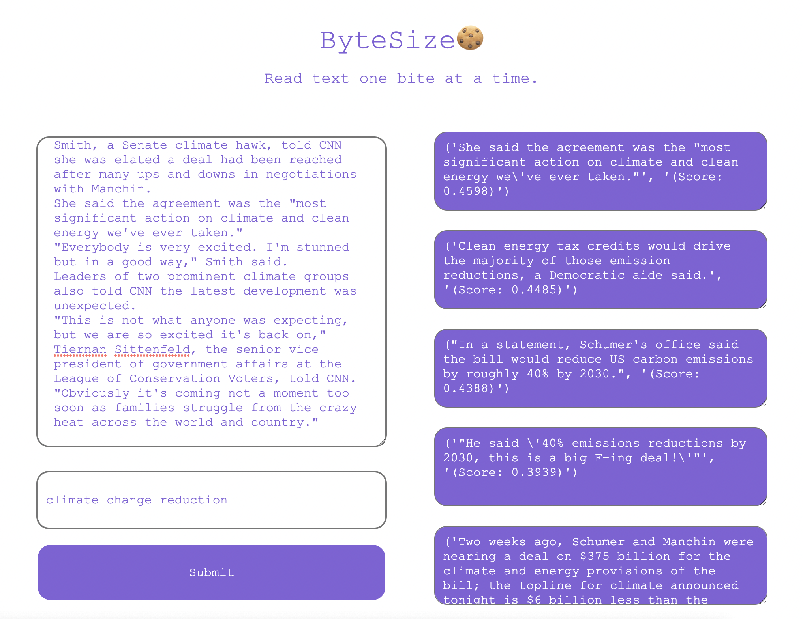

# ByteSize

## Summary

ByteSize allows users to find information in documents with phrases and related terms as opposed to Command-F's requirement of being verbatim. This project was made during UMD's Bitcamp Hackathon competititon.

Credit for model: [Semantic Similarity model](https://towardsdatascience.com/semantic-similarity-using-transformers-8f3cb5bf66d6)

## Demo

In the image above the user's text is located in the top left element and the paraphrased search key is in the element below. The results of the model are displayed on the right. Within each result item, you can see the relevant sentence and the score given by the model.

## Places to Improve

In some cases, the sentences proposed by the model are irrelevant to the search key. Furthermore, the UI has the following bugs: rendering issues with repeated searches & issues handling multiple search keys.
